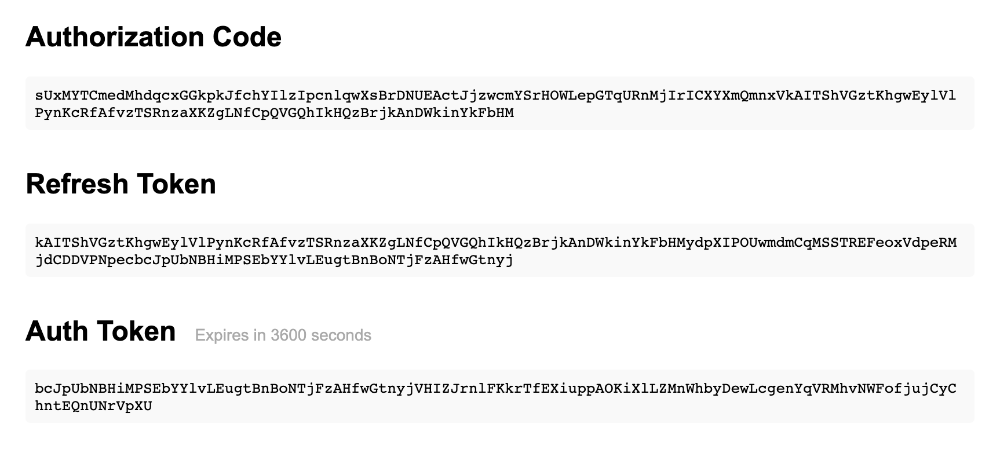

# Spotify-OAuth2-Helper

> A little helper utility for generating tokens for the Spotify Web API.

This is meant to be a painless way to get a refresh token and access token to the Spotify Web API. All you need to is set up an application on Spotify's developer dashboard.

## Instructions

1. Head to the [Spotify dashboard](https://developer.spotify.com/dashboard/applications)
1. Create a new application
1. Add this redirect URI to your application: http://localhost:11011/callback
1. Run the tool (`node index.js` for now - might add to npm or such later)
1. Follow the prompts to enter your client id, client secret, and permissions you app needs
1. Enjoy the Sporify Web API!

Here's some example output (with bogus tokens obviously):

